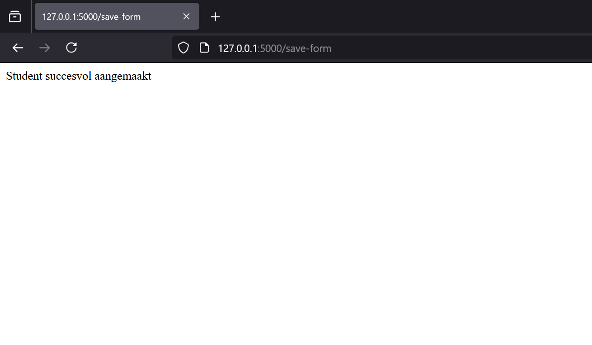
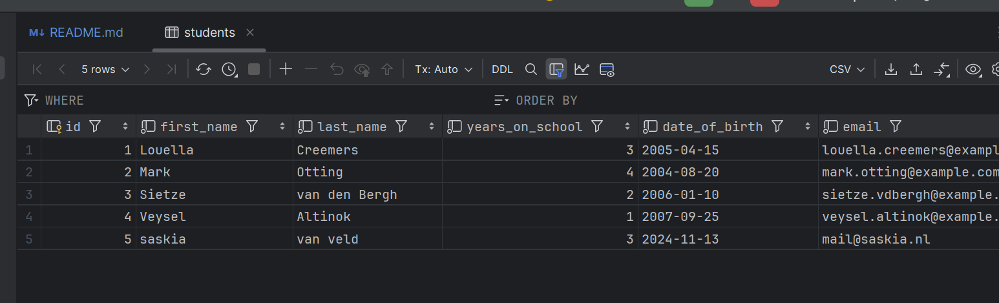
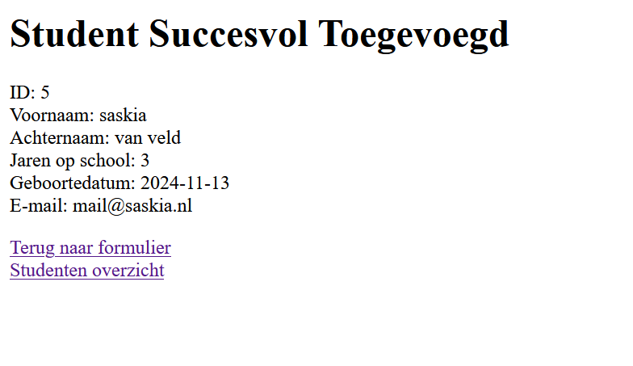
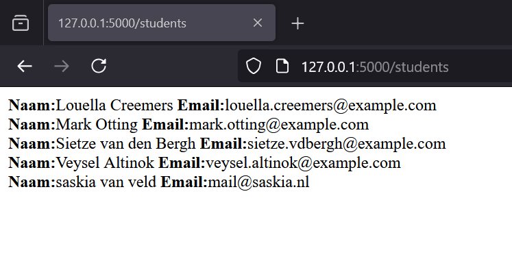

# workshop-flask
In deze workshop bouw je een backend-applicatie om studenten te beheren. Deze workshop gaat verder waar de HTML workshop is gestopt. 
We gaan stap voor stap door het proces: je implementeert een studentenmodel, voegt routes toe om studenten op te slaan en weer te geven, 
en gebruikt templates om gegevens te presenteren.

## Doelen
Na deze workshop kun je:
* Gegevens opslaan in een database met behulp van een model. 
* Routes maken in Flask om gegevens te verwerken en ophalen. 
* Informatie tonen op een eenvoudige webpagina.

## Project structuur
Je project structuur komt er uiteindelijk zo uit te zien:
```
.
├── app.py
├── databases
│   ├── database.py
│   └── database.db (wordt aangemaakt als je de applicatie opstart)
├── models (maken we in de workshop)
│   └── student.py (maken we in de workshop)
├── templates
│   ├── hello_world.html
└── README.md
```

## Wat er al voor je klaar staat
### 1. databases/database.py
Dit bestand bevat een klasse genaamd Database, die zorgt voor het aanmaken en beheren van de database. Je hoeft deze 
klasse niet zelf te schrijven, maar je gaat er wel mee werken.
Code:
```python
import sqlite3  # Imports the sqlite3 module


class Database:
    def __init__(self, path):
        """
        Initialize the database class with a default path.
        Automatically sets up the required tables.
        """
        self.path = path
        self._setup_tables()

    def connect(self):
        """
        Establish and return a new connection to the database.
        """
        con = sqlite3.connect(self.path)
        con.row_factory = sqlite3.Row  # Returns results as dictionaries
        return con

    def _setup_tables(self):
        """
        Create the students table if it doesn't exist and add default entries.
        """
        with self.connect() as con:
            cursor = con.cursor()

            # Create the students table
            cursor.execute('''
                CREATE TABLE IF NOT EXISTS students (
                    id INTEGER PRIMARY KEY AUTOINCREMENT,
                    first_name TEXT NOT NULL,
                    last_name TEXT NOT NULL,
                    years_on_school INTEGER NOT NULL,
                    date_of_birth TEXT NOT NULL,
                    email TEXT NOT NULL,
                    password TEXT NOT NULL
                )
            ''')
            con.commit()

            # Insert default students if they don't already exist
            default_students = [
                ("Louella", "Creemers", 3, "2005-04-15", "louella.creemers@example.com", "password123"),
                ("Mark", "Otting", 4, "2004-08-20", "mark.otting@example.com", "securepass456"),
                ("Sietze", "van den Bergh", 2, "2006-01-10", "sietze.vdbergh@example.com", "mypassword789"),
                ("Veysel", "Altinok", 1, "2007-09-25", "veysel.altinok@example.com", "password456")
            ]

            for student in default_students:
                cursor.execute('''
                    INSERT INTO students (first_name, last_name, years_on_school, date_of_birth, email, password)
                    SELECT ?, ?, ?, ?, ?, ?
                    WHERE NOT EXISTS (
                        SELECT 1 FROM students
                        WHERE first_name = ? AND last_name = ?
                    )
                ''', (*student, student[0], student[1]))

            con.commit()
```
Wat doet dit bestand?

**connect():**<br>
    Maakt een verbinding met de SQLite-database (database.db).
    Zorgt ervoor dat de resultaten als een dictionary worden teruggegeven, zodat je gegevens kunt ophalen met kolomnamen 
    zoals `student['first_name']` in plaats van indexen zoals `student[0]`.

**_setup_tables():**<br>
    Controleert of de tabel students al bestaat. Zo niet, dan wordt deze aangemaakt.
    Voegt standaardstudenten toe, zoals "Louella Creemers" en "Mark Otting", als deze nog niet in de database staan. 
    Dit is handig om een werkend voorbeeld te hebben.


### 2. databases/database.db
Dit is de SQLite-database die door `database.py` wordt aangemaakt en gebruikt. Hier ga jij ook al je gegevens zometeen in
opslaan en ook oproepen. Je ziet deze db file de eerste keer niet. Deze wordt aangemaakt door de `database.py` op het 
moment dat je de applicatie voor het eerst opstart.

### 3. templates/hello_world.html
Dit HTML-bestand bevat een formulier waarmee je gegevens van een nieuwe student kunt invoeren. Hopelijk komt dit je bekend
voor door de HTML workshop van verleden week.

## Opdracht 1 - Maak een student model
Een goede backend is overzichtelijk opgebouwd. Met een apart model zorgen we ervoor dat alle database-acties voor 
studenten op één plek staan. Dit maakt je code herbruikbaar en overzichtelijk.

Het model zorgt ervoor dat:
* Je routes (bijvoorbeeld in `app.py`) eenvoudiger blijven. 
* Je straks makkelijk functies kunt toevoegen, zoals het ophalen van een lijst met studenten.

### Opdracht 1.1 - Het maken van de Student class
* Maak een map `models` als deze nog niet bestaat.
* Maak in deze map een bestand met de naam `student.py`.
* Schrijf een class `Student` die een verbinding maakt met de database.

**Hint:** de Database class vraagt om een path (locatie van de database.py)

<details> <summary><strong>Oplossing: Klik hier om te openen</strong></summary>
in student.py (in de models map):

```python
from databases.database import Database

class Student:
    def __init__(self, db_path):
        """
        Initialize the Student class with a reference to the database.
        """
        self.db = Database(db_path)
```
Wat doet deze code?
* **db_path als parameter:** Hiermee geef je aan waar de database is opgeslagen. Dit maakt het later makkelijk om de locatie 
van de database te veranderen.
* **self.db = Database(db_path):** Hiermee maak je een object van type Database, zodat je straks eenvoudig 
database-functies kunt gebruiken.
</details>

## Opdracht 2 - Het toevoegen van een student in de database
In `hello_world.html` staat een formulier die nu alleen gegevens weergeeft die je net hebt ingevuld. 
Je wilt liever de gegevens van studenten opslaan in een database zodat je ze later weer kan gebruiken voor andere dingen. 
In deze opdracht maak je een functie waarmee je een student kunt toevoegen aan de database.

### Opdracht 2.1 - Het toevoegen van een save_student functie
Schrijf een functie in `student.py` waarmee je een student toevoegt aan de database. Deze functie voert een SQL-query 
uit om de gegevens van een student op te slaan.

**Hints:**
* Gebruik de SQL-query (en vul het aan): `INSERT INTO students (...) VALUES (...)`.
* Roep `commit()` aan na de query om de wijzigingen op te slaan in de database.
* Kijk naar `hello_world.html` om te zien welke informatie je moet opslaan

<details><summary><strong>Geen idee waar je moet beginnen?</strong></summary>
De database aanroepen vanuit een model class is heel makkelijk en constant hetzelfde (op de query en return type na).
Hier is een template die je kan hergebruiken zo vaak als je wilt in een model class:

```python

    def some_function(self, some_parameter_i_need_for_where_or_insert_query):
        con = self.db.connect()
        cursor = con.cursor()
        cursor.execute("SOME SQL QUERY")
        con.commit()   
        # return cursor.fetchall - als je meerdere resultaten verwacht uit de database
        # return cursor.fetchone - als je 1 resultaat verwacht uit de database
        # return cursor.lastrowid - als je het id terugwilt van de laatst toegevoegde student
        # GEEN return is ook oke als je alleen iets wilt opslaan in de database
```
</details>
<details> <summary><strong>Oplossing: Klik hier om te openen</strong></summary>

In het bestand `hello_world.html` staat een formulier waarmee gebruikers gegevens kunnen invoeren. Dit formulier stuurt 
de ingevulde gegevens naar de route `/save-form` in je `app.py`. Hier is het formulier:

```html
    <form method="post" action="/save-form">
        <label for="firstname-input">voornaam</label>
        <input id="firstname-input" name='firstName' type="text">
        <label for="lastname-input">achternaam</label>
        <input id="lastname-input" name="lastName" type="text">
        <label for="yearsOnSchool-input">Jaar op school</label>
        <input id="yearsOnSchool-input" name="yearsOnSchool" type="number">
        <label for="dateOfBirth-input">Geboortedatum</label>
        <input id="dateOfBirth-input" name="dateOfBirth" type="date">
        <label for="email-input">email</label>
        <input id="email-input" name="email" type="email">
        <label for="password-input">Wachtwoord</label>
        <input id="password-input" name="password" type="password">
        <input type="submit">
    </form>
```

In `student.py` wil je deze gegevens meegeven als een parameter (wel in snake_case, want dat moet volgens de Python regeltjes):

```python

    def save_student(self, first_name, last_name, years_on_school, date_of_birth, email, password):
        """
        saves a new student to the database.
        """
        con = self.db.connect()
        cursor = con.cursor()
        cursor.execute(
            "INSERT INTO students (first_name, last_name, years_on_school, date_of_birth, email, password) VALUES (?, ?, ?, ?, ?, ?)",
            (first_name, last_name, years_on_school, date_of_birth, email, password))
        con.commit()
```

Wat doet deze code?
* **con (connection)**:
        Dit is de verbinding met de database. Met deze verbinding kunnen we queries uitvoeren en resultaten ophalen.
        De verbinding wordt gemaakt met de `connect()`-functie van `database.py`.
        Door `self.db.connect()` te gebruiken, sluiten we de verbinding automatisch af na gebruik.
* **cursor**:
        De cursor is een object dat je gebruikt om SQL-commando's uit te voeren.
        Het is een soort "pen" waarmee je queries schrijft en uitvoert op de database.
        Je gebruikt `cursor.execute()` om een query uit te voeren en, bijvoorbeeld, gegevens toe te voegen of op te halen.
* **SQL-query:** De query `INSERT INTO students (...) VALUES (...)` voegt een nieuwe rij met gegevens toe aan de tabel 
students in de database.
* **commit():** Hiermee worden de wijzigingen definitief opgeslagen in de database. Zonder deze stap worden de wijzigingen 
niet bewaard.
</details>

### Opdracht 2.2 - Het aanpassen van save_form in app.py
De route `/save-form` in `app.py` wordt aangeroepen als een gebruiker het formulier in `hello_world.html` invult en op de submit knop klikt. 
Op dit moment doet de functie niet meer dan de ingevoerde voornaam terugsturen als tekst. Om de gegevens echt op te slaan 
in de database, moet de functie aangepast worden.

<details><summary><strong>Reminder: Wat doet de huidige save_form functie in app.py ook alweer?</strong></summary>
De functie save_form in `app.py` ziet er op dit moment zo uit:

```python

@app.route('/save-form', methods=['POST'])
def save_form():
    first_name = request.form['firstName']
    print(request.form)
    return first_name
```

**Wat gebeurt er hier?**
* **request.form:** Dit bevat alle gegevens die vanuit het formulier via een POST-request zijn verzonden (dus lastName, firstName etc.).
* **first_name = request.form['firstName']:** Hier wordt de waarde van het invoerveld firstName opgehaald.
* **print(request.form):** Print alle gegevens uit het formulier naar de console. 
* **return first_name:** Stuurt alleen de opgehaalde firstName terug naar de browser.

Onthoud: POST requests zijn om gegevens naar de database te sturen, GET requests zijn om gegevens van de database te krijgen. 
Verbeeld het als een postbode die pakketjes bezorgd of levert.
</details>

**Je gaat deze functie uitbreiden zodat:**
* Alle gegevens uit het formulier worden opgehaald (niet alleen firstName).
* De functie `save_student` wordt aangeroepen om deze gegevens op te slaan in de database.
* Een eenvoudige HTML-string terug wordt gegeven waarin staat dat de student succesvol is opgeslagen.

**Hints:**
* Voeg student_model toe boven je routes in `app.py` als Student object met de database path als parameter zodat je de `save_student`functie kan aanroepen
* Gebruik `request.form.get('name'`) om de waarde van een veld in `hello_world.html` op te halen. Dit voorkomt fouten als het veld leeg is. Geef elk veld zijn eigen variabel in `app.py`.
* Roep de `save_student`-functie aan met de opgehaalde waarden.
* Nadat de student is opgeslagen, stuur een simpel bericht zoals `<p>Student succesvol aangemaakt</p>`.

<details> <summary><strong>Oplossing: Klik hier om te openen</strong></summary>

```python

student_model = Student('./databases/database.db') #deze hoort boven de / route

@app.route('/save-form', methods=['POST'])
def save_form():
    # Collect form data from the request
    first_name = request.form.get('firstName')
    last_name = request.form.get('lastName')
    years_on_school = int(request.form.get('yearsOnSchool', 0))  # Convert to int for years on school
    date_of_birth = request.form.get('dateOfBirth')
    email = request.form.get('email')
    password = request.form.get('password')

    # Save the new student record in the database
    student_model.save_student(first_name, last_name, years_on_school, date_of_birth, email, password)

    return '<p>Student succesvol aangemaakt</p'

```

Als je nog wat packages mist dan zijn dat waarschijnlijk:
```python
from flask import request
from models.student import *
```

**Wat doet deze aangepaste functie?**
* **Gegevens ophalen:** Alle invoervelden uit het formulier worden opgehaald met request.form.get().
* **save_student aanroepen:** De opgehaalde gegevens worden doorgegeven aan de save_student-functie om de student op te slaan.
* **HTML teruggeven:** Na het opslaan stuurt de functie een eenvoudig bevestigingsbericht terug naar de gebruiker.
</details>

Start je Flask applicatie op na het afronden van deze opdracht. Als je nu gegevens van een student invult en op de submit 
knop klikt krijg je als het goed is het volgende te zien:<br>
 

Als je de database-viewer (View -> Tool Windows -> Database) opent hier in PyCharm zie je de gegevens nu ook in het 
students tabel staan door met je rechtermuisknop op het students tabel te klikken en daarna op Edit Data:<br>


Als je de database niet in de lijst ziet staan bij het Database-tabje, klik dan op het plusje (+), dan op `Data Source from Path` en selecteer
dan database.db in de databases folder. 

## Opdracht 3 - Het weergeven van 1 student
Tot nu toe sla je gegevens van een student op, maar je hebt geen eenvoudige manier om te controleren of de opgeslagen 
gegevens correct zijn. In deze opdracht pas je je code aan en voeg je wat code toe zodat je na het opslaan de gegevens van de student
die je hebt ingevuld kunt weergeven op een HTML-pagina. Dit helpt niet alleen bij het testen van je applicatie, maar 
laat ook zien hoe je gegevens 1 persoon uit de database kunt ophalen.

### Opdracht 3.1 - Het toevoegen van de get_single_student functie
In `student.py` hebben we een get_single_student functie nodig die een id parameter accepteert om de student te kunnen zoeken in de database.

Schrijf een functie in `student.py` die de gegevens van een specifieke student ophaalt uit de database. De functie accepteert het ID van de student als parameter.

**Hints:**
* Gebruik de SQL-query `SELECT * FROM students WHERE id = ?`.
* Gebruik cursor.fetchone() om één rij uit de database op te halen.
* Gebruik het 'Geen idee waar je moet beginnen?' 2.1 als spiekbrief voor je functie

<details> <summary><strong>Oplossing: Klik hier om te openen</strong></summary>

```python
    def get_single_student(self, student_id):
        """
        Retrieve a single student's details from the database by ID.
        """
        con = self.db.connect()
        cursor = con.cursor()
        cursor.execute("SELECT * FROM students WHERE id = ?", (student_id,))
        return cursor.fetchone()
``` 
**Wat doet deze code?**
* **SQL-query:** `SELECT * FROM students WHERE id = ?` zoekt naar een student met het opgegeven ID.
* **cursor.fetchone():** Haalt de eerste (en in dit geval enige) rij op die voldoet aan de query.
* **Parameters:** Het gebruik van `?` en `(student_id,)` zorgt ervoor dat je op een specifiek id kan zoeken die door `app.py` meegegeven wordt.

</details>

### Opdracht 3.2 - Het aanpassen van save_form in app.py
Je gaat de functie `save_form` in `app.py` aanpassen zodat deze na het opslaan van een student:
* Het ID van de opgeslagen student ophaalt zodra deze is opgeslagen in de database.
* De details van die student toont in een eenvoudige HTML-string.

**Hints:**
* Pas de functie `save_student` in `student.py` aan zodat deze het ID van de nieuw opgeslagen student retourneert.
**<br><br>In `app.py`:**
* Voeg een variabel toe aan `student_model.save_student` zodat hier de ID van deze student kan plaatsen.
* Gebruik de nieuwe `get_single_student`-functie om de ID van de student alle gegevens op te halen en plaats deze in een variabel.  
* Bouw een HTML-string waarin de details van de student worden getoond.
* Geef in de HTML ook twee `<a>` links mee. 1 naar `/` om terug te gaan naar het formulier, en 1 naar `/students` voor opdracht 4.

<details> <summary><strong>Oplossing student.py: Klik hier om te openen</strong></summary>

```python  
def save_student(self, first_name, last_name, years_on_school, date_of_birth, email, password):
        """
        saves a new student to the database.
        """
        con = self.db.connect()
        cursor = con.cursor()
        cursor.execute(
            "INSERT INTO students (first_name, last_name, years_on_school, date_of_birth, email, password) VALUES (?, ?, ?, ?, ?, ?)",
            (first_name, last_name, years_on_school, date_of_birth, email, password))
        con.commit()
        return cursor.lastrowid
```

**Wat doet cursor.lastrowid?**
* Dit retourneert het ID van de laatst toegevoegde rij in de database.
* Hiermee kun je direct het ID van de zojuist opgeslagen student ophalen.
</details>

<details> <summary><strong>Oplossing app.py: Klik hier om te openen</strong></summary>

```python
@app.route('/save-form', methods=['POST'])
def save_form():
    # Collect form data from the request
    first_name = request.form.get('firstName')
    last_name = request.form.get('lastName')
    years_on_school = int(request.form.get('yearsOnSchool', 0))  # Convert to int for years on school
    date_of_birth = request.form.get('dateOfBirth')
    email = request.form.get('email')
    password = request.form.get('password')

    # Save the new student record in the database
    student_id = student_model.save_student(first_name, last_name, years_on_school, date_of_birth, email, password)
    student_added = student_model.get_single_student(student_id)

    result = f"""
    <h1>Student Succesvol Toegevoegd</h1>
    <p>
        ID: {student_added['id']}<br>
        Voornaam: {student_added['first_name']}<br>
        Achternaam: {student_added['last_name']}<br>
        Jaren op school: {student_added['years_on_school']}<br>
        Geboortedatum: {student_added['date_of_birth']}<br>
        E-mail: {student_added['email']}
    </p>
    <a href="/">Terug naar formulier</a><br>
    <a href="/students" Studenten overzicht</a><br>
    """

    return result
```
**Wat gebeurt er hier?**
* **student_id ophalen:** Na het opslaan van een student retourneert save_student het ID van de nieuwe rij. 
* **Details ophalen:** Met get_single_student(student_id) worden de gegevens van de opgeslagen student opgehaald.
* **HTML-string bouwen:** De gegevens worden getoond in een eenvoudige HTML-string.

</details>

Als je nu je Flask app opstart en gegevens invoert in je formulier zie je iets zoals dit:<br>


## Opdracht 4 - Alle studenten weergeven
Soms wil je niet alleen één specifieke student bekijken, maar een overzicht van alle studenten in de database. 
In deze laatste opdracht leer je hoe je alle studenten kunt ophalen en tonen. Dit is handig voor lijsten of dashboards 
in je applicatie.

### Opdracht 4.1 - Het toevoegen van de get_all_students functie
Je gaat een functie schrijven in `student.py` die alle studenten ophaalt uit de database.

**Hints:**
* Gebruik de SQL-query `SELECT * FROM students` om alle rijen uit de tabel te halen.
* Gebruik de juiste cursor return type om ALLE resultaten uit de Student table te returnen.
* Gebruik indien nodig de `Weet niet waar ik moet beginnen` gedeelte in 2.1 als spiekbriefje voor je functie.

<details> <summary><strong>Oplossing: Klik hier om te openen</strong></summary>

```python
def get_all_students(self):
    """
    Retrieve all students from the database.
    """
    con = self.db.connect()
    cursor = con.cursor()
    cursor.execute("SELECT * FROM students")
    return cursor.fetchall()
```
**Wat doet deze code?**
* **SQL-query:** `SELECT * FROM students` haalt alle rijen en kolommen op uit de tabel students.
* **cursor.fetchall():** Retourneert een lijst van alle rijen die door de query zijn gevonden. Elke rij wordt als een dictionary teruggegeven omdat we con.row_factory = sqlite3.Row gebruiken.
</details>

### Opdracht 4.2 - Het aanmaken van een route voor /students in app.py
Je gaat een nieuwe route toevoegen in `app.py`. Deze route haalt alle studenten op met de functie `get_all_students` en toont de gegevens in een eenvoudige HTML-string. 
In plaats van een lijst, gebruik je een reeks `<b>`-tags en `<br>`-tags om de studenteninformatie te presenteren.

**Hints:**
* Maak een functie list_students aan in `app.py` met route `/students`. Dit is een functie waar je alleen iets wilt KRIJGEN van de database.
* Roep de functie die alle students returned in `student_model` op en plaats deze in een variabel
* Gebruik een loop (for student in students) om door alle studenten heen te lopen.
* Voeg `<b>` tags toe om specifieke informatie, zoals de naam en e-mail, te benadrukken.

<details> <summary><strong>Oplossing: Klik hier om te openen</strong></summary>

```python
@app.route('/students', methods=['GET'])
def list_students():
    students = student_model.get_all_students()

    result = ""
    for student in students:
        result += '<b>Naam:</b>' + student['first_name'] + ' ' + student['last_name'] + ' <b>Email:</b>' + student['email'] + '<br>'
    return result
```

**Wat gebeurt er hier?**
* **Studenten ophalen:** De functie get_all_students() haalt een lijst van alle studenten op.
* **HTML bouwen:** Met een for-loop worden de gegevens van elke student toegevoegd aan een string. De gegevens worden omgeven door `<b>`-tags voor opmaak. 
* **HTML retourneren:** De HTML-string met alle studenten wordt teruggestuurd naar de browser.
</details>

Zodra deze opdracht afgerond is kan je je Flask applicatie opstarten en het uitproberen. Dit kan op 2 manieren:
1. Door naar `localhost:5000/students` te gaan
2. Door een student toe te voegen via het formulier en daarna op `Studenten overzicht` te klikken.

Je studenten-overzicht zou er zo uit moeten zien:<br>


## **Goed gedaan!**

Gefeliciteerd! 🎉 Je hebt zojuist je eerste Flask-backend gebouwd waarin je gegevens kunt opslaan, ophalen en weergeven. Dit is een belangrijke stap in het leren van webontwikkeling en vormt de basis voor veel real-world applicaties.

### **Wat heb je geleerd?**
- **Het maken van een studentmodel:** Je hebt geleerd hoe je een Python-klasse schrijft die met een database kan communiceren.
- **Gegevens opslaan in een database:** Door middel van een formulier en een SQL-query kun je nu gegevens van gebruikers toevoegen aan een database.
- **Gegevens ophalen:** Je hebt geleerd hoe je een specifieke student of een lijst van alle studenten uit de database kunt halen.
- **Eenvoudige webpagina's tonen:** Je hebt gegevens weergegeven op een webpagina met behulp van HTML-strings.

