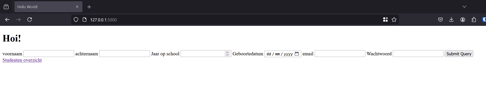
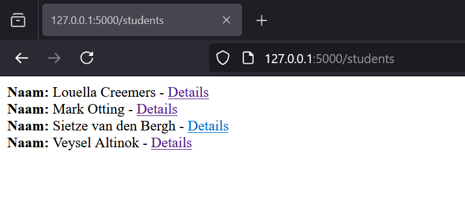
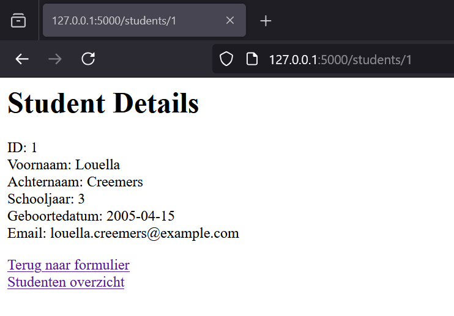
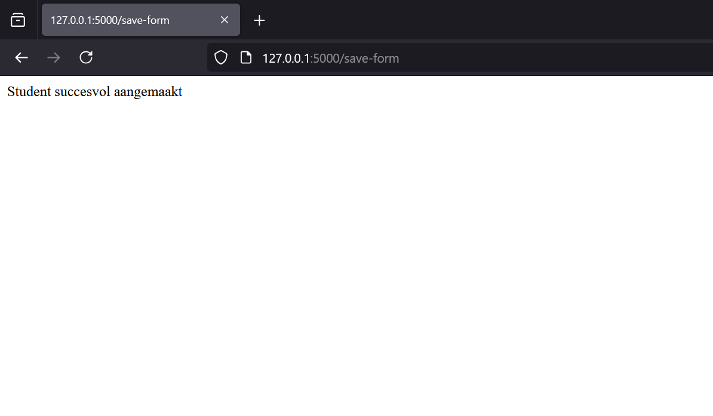
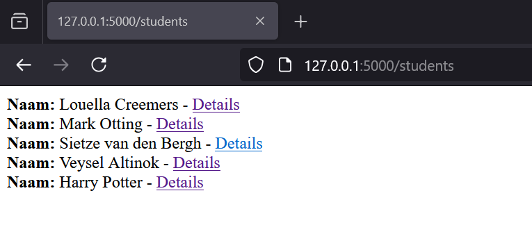
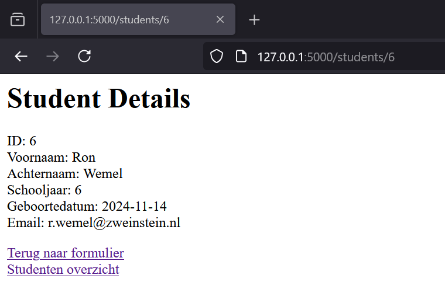

# workshop-flask
In deze workshop bouw je een backend-applicatie om studenten te beheren. Deze workshop gaat verder waar de HTML workshop is gestopt. 
We gaan stap voor stap door het proces: je implementeert een studentenmodel, voegt routes toe om studenten op te slaan en weer te geven, 
en gebruikt templates om gegevens te presenteren.

## **Inhoudsopgave**

## **Inhoudsopgave**

1. [Introductie](#introductie)
2. [Doelen](#doelen)
3. [Project Structuur](#project-structuur)
4. [Opdracht 0 - Setup voor Flask](#opdracht-0---setup-voor-flask)
   - [Opdracht 0.1 - Installeer Flask](#opdracht-01---installeer-flask)
   - [Opdracht 0.2 - Controleer de Flask-installatie](#opdracht-02---controleer-de-flask-installatie)
   - [Opdracht 0.3 - Start de applicatie](#opdracht-03---start-de-applicatie)
5. [Opdracht 1 - Maak een student model](#opdracht-1---maak-een-student-model)
   - [Opdracht 1.1 - Het maken van de Student class](#opdracht-11---het-maken-van-de-student-class)
6. [Opdracht 2 - Alle studenten weergeven](#opdracht-2---alle-studenten-weergeven)
   - [Opdracht 2.1 - Het toevoegen van de get_all_students functie](#opdracht-21---het-toevoegen-van-de-get_all_students-functie)
   - [Opdracht 2.2 - Het aanmaken van een route voor /students in app.py](#opdracht-22---het-aanmaken-van-een-route-voor-students-in-apppy)
7. [Opdracht 3 - Het weergeven van 1 student](#opdracht-3---het-weergeven-van-1-student)
   - [Opdracht 3.1 - Het toevoegen van de get_single_student functie](#opdracht-31---het-toevoegen-van-de-get_single_student-functie)
   - [Opdracht 3.2 - Het aanmaken van een nieuwe route in app.py](#opdracht-32---het-aanmaken-van-een-nieuwe-route-in-apppy)
8. [Opdracht 4 - Het toevoegen van een student in de database](#opdracht-4---het-toevoegen-van-een-student-in-de-database)
   - [Opdracht 4.1 - Het toevoegen van een save_student functie](#opdracht-41---het-toevoegen-van-een-save_student-functie)
   - [Opdracht 4.2 - Het aanpassen van save_form in app.py](#opdracht-42---het-aanpassen-van-save_form-in-apppy)
   - [Opdracht 4.3 - Kleine aanpassingen](#opdracht-43---kleine-aanpassingen)

## Doelen
Na deze workshop kun je:
* Gegevens opslaan in een database met behulp van een model. 
* Routes maken in Flask om gegevens te verwerken en ophalen. 
* Informatie tonen op een eenvoudige webpagina.

## Project structuur
Je project structuur komt er uiteindelijk zo uit te zien:
```
.
├── app.py
├── databases
│   ├── database.py
│   └── database.db (wordt aangemaakt als je de applicatie opstart)
├── models (maken we in de workshop)
│   └── student.py (maken we in de workshop)
├── templates
│   ├── hello_world.html
└── README.md
```

## Wat er al voor je klaar staat
### 1. databases/database.py
Dit bestand bevat een klasse genaamd Database, die zorgt voor het aanmaken en beheren van de database. Je hoeft deze 
klasse niet zelf te schrijven, maar je gaat er wel mee werken.
Code:
```python
import sqlite3  # Imports the sqlite3 module


class Database:
    def __init__(self, path):
        """
        Initialize the database class with a default path.
        Automatically sets up the required tables.
        """
        self.path = path
        self._setup_tables()

    def connect(self):
        """
        Establish and return a new connection to the database.
        """
        con = sqlite3.connect(self.path)
        con.row_factory = sqlite3.Row  # Returns results as dictionaries
        return con

    def _setup_tables(self):
        """
        Create the students table if it doesn't exist and add default entries.
        """
        with self.connect() as con:
            cursor = con.cursor()

            # Create the students table
            cursor.execute('''
                CREATE TABLE IF NOT EXISTS students (
                    id INTEGER PRIMARY KEY AUTOINCREMENT,
                    first_name TEXT NOT NULL,
                    last_name TEXT NOT NULL,
                    years_on_school INTEGER NOT NULL,
                    date_of_birth TEXT NOT NULL,
                    email TEXT NOT NULL,
                    password TEXT NOT NULL
                )
            ''')
            con.commit()

            # Insert default students if they don't already exist
            default_students = [
                ("Louella", "Creemers", 3, "2005-04-15", "louella.creemers@example.com", "password123"),
                ("Mark", "Otting", 4, "2004-08-20", "mark.otting@example.com", "securepass456"),
                ("Sietze", "van den Bergh", 2, "2006-01-10", "sietze.vdbergh@example.com", "mypassword789"),
                ("Veysel", "Altinok", 1, "2007-09-25", "veysel.altinok@example.com", "password456")
            ]

            for student in default_students:
                cursor.execute('''
                    INSERT INTO students (first_name, last_name, years_on_school, date_of_birth, email, password)
                    SELECT ?, ?, ?, ?, ?, ?
                    WHERE NOT EXISTS (
                        SELECT 1 FROM students
                        WHERE first_name = ? AND last_name = ?
                    )
                ''', (*student, student[0], student[1]))

            con.commit()
```
Wat doet dit bestand?

**connect():**<br>
    Maakt een verbinding met de SQLite-database (database.db).
    Zorgt ervoor dat de resultaten als een dictionary worden teruggegeven, zodat je gegevens kunt ophalen met kolomnamen 
    zoals `student['first_name']` in plaats van indexen zoals `student[0]`.

**_setup_tables():**<br>
    Controleert of de tabel students al bestaat. Zo niet, dan wordt deze aangemaakt.
    Voegt standaardstudenten toe, zoals "Louella Creemers" en "Mark Otting", als deze nog niet in de database staan. 
    Dit is handig om een werkend voorbeeld te hebben.


### 2. databases/database.db
Dit is de SQLite-database die door `database.py` wordt aangemaakt en gebruikt. Hier ga jij ook al je gegevens zometeen in
opslaan en ook oproepen. Je ziet deze db file de eerste keer niet. Deze wordt aangemaakt door de `database.py` op het 
moment dat je de applicatie voor het eerst opstart.

### 3. templates/hello_world.html
Dit HTML-bestand bevat een formulier waarmee je gegevens van een nieuwe student kunt invoeren. Hopelijk komt dit je bekend
voor door de HTML workshop van verleden week.


## Opdracht 0 - Setup voor Flask
In deze opdracht installeren we Flask en starten we de applicatie direct vanuit PyCharm. We doen dit zodat je weet hoe je
een Flask applicatie moet opstarten EN zodat we zeker weten dat Flask werkt op je laptop.

### Opdracht 0.1 - Installeer Flask
* Open PyCharm en zorg dat dit project is gecloned en geopend.
* Open de terminal in PyCharm (View > Tool Windows > Terminal) of gebruik het tabblad "Terminal" onderin. 
* Installeer Flask met het volgende commando:
```bash
pip install flask
```
### Opdracht 0.2 - Controleer de Flask-installatie
Controleer of Flask correct is geïnstalleerd door in de terminal het volgende commando uit te voeren:
```bash
pip show flask
```

Je zou een resultaat moeten zien zoals dit:
```bash
Name: Flask
Version: X.X.X
Summary: A simple framework for building complex web applications.
Location: ...
```

### Opdracht 0.3 - Start de applicatie
Zorg ervoor dat je app.py niet aanpast naar clonen, en start de Flask applicatie door op het start-knopje te klikken rechtsboven.
Zodra je terminal aangeeft dat `127.0.0.1:5000` running is, kan je op de link klikken en dan zie je de form van `hello_world.html`, want die zit op dit moment op root (dus route `/`):<br>


De studenten overzicht link werkt niet. Dat lossen we op in opdracht 2.

## Opdracht 1 - Maak een student model
Een goede backend is overzichtelijk opgebouwd. Met een apart model zorgen we ervoor dat alle database-acties voor 
studenten op één plek staan. Dit maakt je code herbruikbaar en overzichtelijk.

Het model zorgt ervoor dat:
* Je routes (bijvoorbeeld in `app.py`) eenvoudiger blijven. 
* Je straks makkelijk functies kunt toevoegen, zoals het ophalen van een lijst met studenten.

### Waarom hebben we een model class zoals Student nodig?
Wanneer je een backend bouwt, wil je graag dat je code netjes gestructureerd is. Hier zijn een paar redenen waarom we een aparte `Student` class gebruiken:

1. **Alles op één plek houden:**
   - Alle database-acties die met studenten te maken hebben, worden in de `Student` class geplaatst. Hierdoor hoef je niet overal in je code te zoeken als je iets wilt aanpassen.

2. **Minder dubbele code:**
   - Stel dat je op meerdere plekken studenten uit de database wilt ophalen. Met een `Student` class hoef je de database-logica maar één keer te schrijven. Daarna kun je overal de functies uit de class gebruiken.

3**Toekomstbestendig:**
   - Als je later nieuwe dingen aan je applicatie toevoegt (zoals een extra veld in de database of nieuwe functies), hoef je alleen de `Student` class aan te passen. De rest van je code blijft werken.

4**Best practices:**
   - Het gebruik van een model class is een standaardmanier om grotere applicaties te bouwen. Dit maakt je project niet alleen professioneler, maar ook veel makkelijker te onderhouden.

### Opdracht 1.1 - Het maken van de Student class
* Maak een map `models` als deze nog niet bestaat.
* Maak in deze map een bestand met de naam `student.py`.
* Schrijf een class `Student` die een verbinding maakt met de database.

**Hint:** de Database class vraagt om een path (locatie van de `database.db`)

<details> <summary><strong>Oplossing: Klik hier om te openen</strong></summary>
in student.py (in de models map):

```python
from databases.database import Database

class Student:
    def __init__(self, db_path):
        """
        Initialize the Student class with a reference to the database.
        """
        self.db = Database(db_path)
```
Wat doet deze code?
* **db_path als parameter:** Hiermee geef je aan waar de database is opgeslagen. Dit maakt het later makkelijk om de locatie 
van de database te veranderen.
* **self.db = Database(db_path):** Hiermee maak je een object van type Database, zodat je straks eenvoudig 
database-functies kunt gebruiken.
</details>

## Opdracht 2 - Alle studenten weergeven
`database.py`. maakt na de eerste keer opstarten voor ons een `students` table aan met 4 students erin (die toevallig heel veel 
weg hebben van werkplaats docenten). Het zou heel handig zijn om in de browser een soort van overview of dashboard te hebben om deze allemaal in te zien.

### Opdracht 2.1 - Het toevoegen van de get_all_students functie

Schrijf in student.py een functie get_all_students die een lijst met alle studenten ophaalt.

**Hints:**
* Gebruik de SQL-query `SELECT * FROM students` om alle rijen uit de tabel te halen.
* Gebruik de cursor om je SQL-query uit te voeren.
* Roep `con.commit()` aan na de query om de wijzigingen op te slaan in de database.
* Gebruik de return functie `fetchall()` op cursor om alle rijen uit de database terug te krijgen.

<details><summary><strong>Geen idee waar je moet beginnen?</strong></summary>
De database aanroepen vanuit een model class is heel makkelijk en constant hetzelfde (op de query en return type na).
Hier is een template die je kan hergebruiken zo vaak als je wilt in een model class:

```python

    def some_function(self, some_parameter_i_need_for_where_or_insert_query):
        con = self.db.connect()
        cursor = con.cursor()
        cursor.execute("SOME SQL QUERY")
        con.commit()   
        # return cursor.fetchall - als je meerdere resultaten verwacht uit de database
        # return cursor.fetchone - als je 1 resultaat verwacht uit de database
        # return cursor.lastrowid - als je het id terugwilt van de laatst toegevoegde student
        # GEEN return is ook oke als je alleen iets wilt opslaan in de database
```
</details>

<details><summary><strong>Oplossing: Klik hier om te openen</strong></summary>

```python
def get_all_students(self):
    """
    Retrieve all students from the database.
    """
    con = self.db.connect()
    cursor = con.cursor()
    cursor.execute("SELECT * FROM students")
    con.commit()   
    return cursor.fetchall()
```

Wat doet deze code?
* **con (connection)**:
        Dit is de verbinding met de database. Met deze verbinding kunnen we queries uitvoeren en resultaten ophalen.
        De verbinding wordt gemaakt met de `connect()`-functie van `database.py`.
        Door `self.db.connect()` te gebruiken, sluiten we de verbinding automatisch af na gebruik.
* **cursor**:
        De cursor is een object dat je gebruikt om SQL-commando's uit te voeren.
        Het is een soort "pen" waarmee je queries schrijft en uitvoert op de database.
        Je gebruikt `cursor.execute()` om een query uit te voeren en, bijvoorbeeld, gegevens toe te voegen of op te halen.
* **SQL-query:** De query `SELECT * FROM students`` selecteert alle rijen uit het students tabel.
* **commit():** Hiermee worden de wijzigingen definitief opgeslagen in de database. Zonder deze stap worden de wijzigingen 
niet bewaard.
* **cursor.fetchall()**: de cursor returnt ook de resultaat van je SQL-query.In dit geval returnt die alles. De veel 
voorkomende return types staan beschreven in de `Geen idee waar je moet beginnen?` gedeelte hierboven.
</details>

### Opdracht 2.2 - Het aanmaken van een route voor /students in app.py
Je gaat een nieuwe route toevoegen in `app.py`. Deze route haalt alle studenten op met de functie `get_all_students` en toont de gegevens in een eenvoudige HTML-string. 
In plaats van een lijst, gebruik je een reeks `<b>`-tags en `<br>`-tags om de studenteninformatie te presenteren.

**Hints:**
* Maak boven je routes een `student_model` object aan van class `Student` met de path naar de database als parameter
* Maak een functie list_students aan in `app.py` met route `/students`, met methode GET om alle studenten mee op te vragen
* Roep de functie die alle students returned in `student_model` op en plaats deze in een variabel
* Gebruik een loop (for student in students) om door alle studenten heen te lopen.
* Voeg `<b>` tags toe om specifieke informatie, zoals de naam en e-mail, te benadrukken.

<details> <summary><strong>Oplossing: Klik hier om te openen</strong></summary>

```python
from models.student import * #deze moet bij de imports van app.py

student_model = Student('./databases/database.db') #deze hoort net onder de imports, boven de route functies

@app.route('/students', methods=['GET'])
def list_students():
    students = student_model.get_all_students()

    result = ""
    for student in students:
        result += f'<b>Naam:</b> {student['first_name']} {student['last_name']} - <a href="/students/{student['id']}"> Details </a><br>'
    return result
```

**Wat gebeurt er hier?**
* **Aanmaken van student_model:** vanuit dit Student object kan je nu alle functies in `student.py` aanroepen.
* **Studenten ophalen:** De functie `get_all_students()` haalt een lijst van alle studenten op.
* **HTML bouwen:** Met een for-loop worden de gegevens van elke student toegevoegd aan een string. De gegevens worden omgeven door `<b>`-tags voor opmaak. 
* **HTML retourneren:** De HTML-string met alle studenten wordt teruggestuurd naar de browser, inclusief een link naar de details van een student die we gaan gebruiken voor opdracht 3.

> Onthoud: POST requests zijn om gegevens naar de database te sturen, GET requests zijn om gegevens van de database te krijgen. 
Verbeeld het als een postbode die pakketjes bezorgd of levert.
</details>

---

Zodra deze opdracht afgerond is kan je je Flask applicatie opstarten en het uitproberen. Dit kan op 2 manieren:
1. Door naar `localhost:5000/students` te gaan
2. Door een student toe te voegen via het formulier en daarna op `Studenten overzicht` te klikken.

Je studenten-overzicht zou er zo uit moeten zien:<br>



## Opdracht 3 - Het weergeven van 1 student
We hebben nu een overview / dashboard in `/students` maar het zou ook fijn zijn als we erop kunnen klikken en de details kunnen 
zien van de studenten in het dashboard. In deze opdracht pas je je code aan en voeg je wat code toe zodat je een student kan aanklikken
en de volledige gegevens kunt weergeven op een HTML-pagina. Hiervoor gaan we een nieuwe functie aanmaken in `student.py` en ook een nieuwe route in `app.py`.

### Opdracht 3.1 - Het toevoegen van de get_single_student functie

Schrijf een functie in `student.py` die de gegevens van een specifieke student ophaalt uit de database. De functie accepteert het ID van de student als parameter.

**Hints:**
* Gebruik de SQL-query `SELECT * FROM students WHERE id = ?`.
* Gebruik de cursor om je SQL-query uit te voeren.
* Roep `con.commit()` aan na de query om de wijzigingen op te slaan in de database.
* Gebruik `cursor.fetchone()` om één rij uit de database op te halen.
* Gebruik het `Geen idee waar je moet beginnen?` gedeelte 2.1 als spiekbrief voor je functie

<details> <summary><strong>Oplossing: Klik hier om te openen</strong></summary>

```python
    def get_single_student(self, student_id):
        """
        Retrieve a single student's details from the database by ID.
        """
        con = self.db.connect()
        cursor = con.cursor()
        cursor.execute("SELECT * FROM students WHERE id = ?", (student_id,))
        return cursor.fetchone()
``` 
**Wat doet deze code?**
* **SQL-query:** `SELECT * FROM students WHERE id = ?` zoekt naar een student met het opgegeven ID.
* **cursor.fetchone():** Haalt de eerste (en in dit geval enige) rij op die voldoet aan de query.
* **Parameters:** Het gebruik van `?` en `(student_id,)` zorgt ervoor dat je op een specifiek id kan zoeken die door `app.py` meegegeven wordt.

</details>


### Opdracht 3.2 - Het aanmaken van een nieuwe route in app.py
Maak in `app.py` een nieuwe route `/students/<id>`. Deze route toont de details van een specifieke student op basis van het ID dat is meegegeven in de URL.

**Hints:**
* Zorg dat je de parameter `student_id` aan je route meegeeft in de functie.
* Gebruik de functie `get_single_student` uit `student.py` om de gegevens van de student op te halen.
* Bouw een eenvoudige HTML-string om de studentgegevens weer te geven.
* Maak een `<a href>` in HTML naar /students voor student overzicht
* Maak een `<a href>` in HTML naar / waar we in opdracht 4 aan gaan werken aan het HTML formulier.

<details><summary><strong>Oplossing: Klik hier om te openen</strong></summary>

```python
@app.route('/students/<student_id>', methods=['GET'])
def show_student(student_id):
    # Fetch the details of the student
    student = student_model.get_single_student(student_id)

    # Build an HTML string with the student details
    result = f"""
    <h1>Student Details</h1>
    <p>
        ID: {student['id']}<br>
        Voornaam: {student['first_name']}<br>
        Achternaam: {student['last_name']}<br>
        Schooljaar: {student['years_on_school']}<br>
        Geboortedatum: {student['date_of_birth']}<br>
        Email: {student['email']}
    </p>
    <a href="/">Terug naar formulier</a><br>
    <a href="/students">Studenten overzicht</a><br>
    """
    return result
```

Wat gebeurt er hier?
* **Route met parameter:** De student_id-parameter uit de URL wordt automatisch doorgegeven aan de functie.
* **Gegevens ophalen:** Met get_single_student(student_id) wordt de juiste student opgehaald.
* **HTML bouwen:** De details van de student worden getoond in een overzichtelijke HTML-string.

</details>

---

Je kan dit nu testen door je flask applicatie op te starten en naar `localhost:5000/students/1` te gaan of door op de `details` link te klikken van de eerste student bij `localhost:5000/students`. Dan zie je dit:<br>



## Opdracht 4 - Het toevoegen van een student in de database
In `hello_world.html` staat een formulier die nu alleen gegevens weergeeft die je net hebt ingevuld, deze formulier wordt
meteen weergegeven als je de applicatie start omdat die in de root (route `/`) staat.  Je wilt liever de gegevens van studenten opslaan in de database zodat je ze later weer kan gebruiken voor andere dingen, 
en je ermee kan werken in je dashboard. In deze opdracht maak je een functie waarmee je een student kunt toevoegen aan 
de database.

### Opdracht 4.1 - Het toevoegen van een save_student functie
Schrijf een functie in `student.py` waarmee je een student toevoegt aan de database. Deze functie voert een SQL-query 
uit om de gegevens van een student op te slaan.

**Hints:**
* Gebruik de SQL-query (en vul het aan): `INSERT INTO students (...) VALUES (...)`.
* Gebruik de cursor om je SQL query uit te voeren.
* Roep `con.commit()` aan na de query om de wijzigingen op te slaan in de database.
* Kijk naar `hello_world.html` om te zien welke informatie je moet opslaan
* Gebruik het `Geen idee waar je moet beginnen?` gedeelte in 2.1 als spiekbriefje voor je functie.

<details> <summary><strong>Oplossing: Klik hier om te openen</strong></summary>

In het bestand `hello_world.html` staat een formulier waarmee gebruikers gegevens kunnen invoeren. Dit formulier stuurt 
de ingevulde gegevens naar de route `/save-form` in je `app.py`. Hier is het formulier:

```html
    <form method="post" action="/save-form">
        <label for="firstname-input">voornaam</label>
        <input id="firstname-input" name='firstName' type="text">
        <label for="lastname-input">achternaam</label>
        <input id="lastname-input" name="lastName" type="text">
        <label for="yearsOnSchool-input">Jaar op school</label>
        <input id="yearsOnSchool-input" name="yearsOnSchool" type="number">
        <label for="dateOfBirth-input">Geboortedatum</label>
        <input id="dateOfBirth-input" name="dateOfBirth" type="date">
        <label for="email-input">email</label>
        <input id="email-input" name="email" type="email">
        <label for="password-input">Wachtwoord</label>
        <input id="password-input" name="password" type="password">
        <input type="submit">
    </form>
```

In `student.py` wil je deze gegevens meegeven als een parameter (wel in snake_case, want dat moet volgens de Python regeltjes):
```python

    def save_student(self, first_name, last_name, years_on_school, date_of_birth, email, password):
        """
        saves a new student to the database.
        """
        con = self.db.connect()
        cursor = con.cursor()
        cursor.execute(
            "INSERT INTO students (first_name, last_name, years_on_school, date_of_birth, email, password) VALUES (?, ?, ?, ?, ?, ?)",
            (first_name, last_name, years_on_school, date_of_birth, email, password))
        con.commit()
```
</details>

### Opdracht 4.2 - Het aanpassen van save_form in app.py
De route `/save-form` in `app.py` wordt aangeroepen als een gebruiker het formulier in `hello_world.html` invult en op de submit knop klikt. 
Op dit moment doet de functie niet meer dan de ingevoerde voornaam terugsturen als tekst. Om de gegevens echt op te slaan 
in de database, moet de functie aangepast worden.

<details><summary><strong>Reminder: Wat doet de huidige save_form functie in app.py ook alweer?</strong></summary>
De functie save_form in `app.py` ziet er op dit moment zo uit:

```python

@app.route('/save-form', methods=['POST'])
def save_form():
    first_name = request.form['firstName']
    print(request.form)
    return first_name
```

**Wat gebeurt er hier?**
* **request.form:** Dit bevat alle gegevens die vanuit het formulier via een POST-request zijn verzonden (dus lastName, firstName etc.).
* **first_name = request.form['firstName']:** Hier wordt de waarde van het invoerveld firstName opgehaald.
* **print(request.form):** Print alle gegevens uit het formulier naar de console. 
* **return first_name:** Stuurt alleen de opgehaalde firstName terug naar de browser.
</details>

**Je gaat deze functie uitbreiden zodat:**
* Alle gegevens uit het formulier worden opgehaald (niet alleen firstName).
* De functie `save_student` wordt aangeroepen om deze gegevens op te slaan in de database.
* Een eenvoudige HTML-string terug wordt gegeven waarin staat dat de student succesvol is opgeslagen.

**Hints:**
* Voeg student_model toe boven je routes in `app.py` als Student object met de database path als parameter zodat je de `save_student`functie kan aanroepen
* Gebruik `request.form.get('name'`) om de waarde van een veld in `hello_world.html` op te halen. Dit voorkomt fouten als het veld leeg is. Geef elk veld zijn eigen variabel in `app.py`.
* Roep de `save_student`-functie aan met de opgehaalde waarden.
* Nadat de student is opgeslagen, stuur een simpel bericht zoals `<p>Student succesvol aangemaakt</p>`.

<details> <summary><strong>Oplossing: Klik hier om te openen</strong></summary>

```python
@app.route('/save-form', methods=['POST'])
def save_form():
    # Collect form data from the request
    first_name = request.form['firstName']
    last_name = request.form['lastName']
    years_on_school = request.form['yearsOnSchool']
    date_of_birth = request.form['dateOfBirth']
    email = request.form['email']
    password = request.form['password']

    # Save the new student record in the database
    student_model.save_student(first_name, last_name, years_on_school, date_of_birth, email, password)

    return '<p>Student succesvol aangemaakt</p'
```

**Wat doet deze aangepaste functie?**
* **Gegevens ophalen:** Alle invoervelden uit het formulier worden opgehaald met `request.form[]`.
* **save_student aanroepen:** De opgehaalde gegevens worden doorgegeven aan de `save_student`-functie om de student op te slaan.
* **HTML teruggeven:** Na het opslaan stuurt de functie een eenvoudig bevestigingsbericht terug naar de gebruiker.
</details>

---

Start je Flask applicatie op na het afronden van deze opdracht. Als je nu gegevens van een student invult en op de submit 
knop klikt krijg je als het goed is het volgende te zien:<br>
 

Als je naar `/students` gaat zie je nu dat de nieuwe student toegevoegd is:<br>


### Opdracht 4.3 - Kleine aanpassingen
Zo'n `<p>` tag dat zegt dat een student is aangemaakt is handig, maar het kan beter. 
We kunnen de /students/<student_id> route inzetten om meteen de details van de student weer te geven nadat de student 
is aangemaakt. Hiervoor moeten we een cursor return functie toevoegen aan de `save_student` functie in `student.py`, en 
wat kleine aanpassingen maken in de `save_form` functie in `app.py`

**4.3.1 - Pas de save_student-functie aan**
In `student.py` moet je de `save_student`-functie aanpassen zodat deze het ID van de nieuw toegevoegde student returnt. 
Dit ID kunnen we later gebruiken voor de `students/<student_id>` route naar de detailpagina.

Hints:
* Voeg de cursor return functie toe die het ID van de nieuwste student returnt.
* Zorg ervoor dat de rest van de functie hetzelfde blijft (de INSERT-query en het committen van de wijzigingen).
* Kijk naar het spiekbriefje bij het `Geen idee waar je moet beginnen?`gedeelte van 2.1

<details> <summary><strong>Oplossing: Klik hier om te openen</strong></summary>

```python
def save_student(self, first_name, last_name, years_on_school, date_of_birth, email, password):
    """
    Save a new student to the database and return the new student's ID.
    """
    con = self.db.connect()
    cursor = con.cursor()
    cursor.execute(
        """
        INSERT INTO students (first_name, last_name, years_on_school, date_of_birth, email, password) 
        VALUES (?, ?, ?, ?, ?, ?)
        """, 
        (first_name, last_name, years_on_school, date_of_birth, email, password)
    )
    con.commit()
    return cursor.lastrowid  # Return the ID of the newly inserted student
```

**Wat verandert er?** 
* **cursor.lastrowid**: Dit returnt het ID van de rij die zojuist aan de database is toegevoegd. Dit is belangrijk voor de volgende stap.
</details>

---

**4.3.2 - Pas de save_form-route aan**
In `app.py` moet je de `save_form`-route aanpassen zodat de gebruiker wordt doorgestuurd naar de detailpagina van de toegevoegde student.

**Hints:**
* Roep de aangepaste `save_student`-functie aan en sla het gereturnde ID op in een variabele.
* Import de redirect-functie van Flask en gebruik deze om de gebruiker door te sturen naar `/students/<student_id>` als de student aangemaakt is.
* Zorg dat de route `/students/<student_id>` al bestaat (Opdracht 3.2).

<details> <summary><strong>Oplossing: Klik hier om te openen</strong></summary>

```python
from flask import redirect # dit moet bij de rest van de imports

@app.route('/save-form', methods=['POST'])
def save_form():
    # Collect form data from the request
    first_name = request.form['firstName']
    last_name = request.form['lastName']
    years_on_school = request.form['yearsOnSchool']
    email = request.form['email']
    password = request.form['password']

    # Save the new student record in the database and get the new ID
    student_id = student_model.save_student(first_name, last_name, years_on_school, date_of_birth, email, password)

    # Redirect to the student detail page
    return redirect(f'/students/{student_id}')
```
</details>

---

Start nu je Flask applicatie op en vul wat studenten gegevens in je formulier. Als het goed is krijg je nu de details van 
deze nieuwe student te zien door de `/students/<student_id>` route die al langer bestond:<br>



## **Goed gedaan!**

Gefeliciteerd! 🎉 Je hebt zojuist je eerste Flask-backend gebouwd waarin je gegevens kunt opslaan, ophalen en weergeven. Dit is een belangrijke stap in het leren van webontwikkeling en vormt de basis voor veel real-world applicaties.

### **Wat heb je geleerd?**
- **Het maken van een studentmodel:** Je hebt geleerd hoe je een Python-klasse schrijft die met een database kan communiceren.
- **Gegevens opslaan in een database:** Door middel van een formulier en een SQL-query kun je nu gegevens van gebruikers toevoegen aan een database.
- **Gegevens ophalen:** Je hebt geleerd hoe je een specifieke student of een lijst van alle studenten uit de database kunt halen.
- **Eenvoudige webpagina's tonen:** Je hebt gegevens weergegeven op een webpagina met behulp van HTML-strings.

